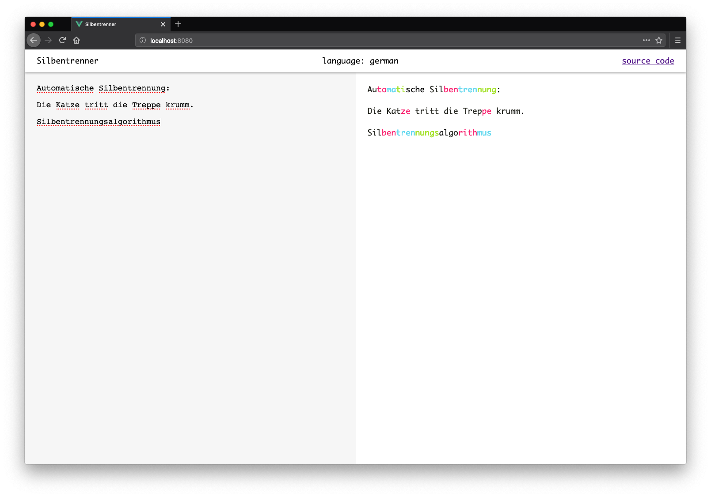

# Silbentrenner [](https://travis-ci.com/jdoubleu/Silbentrenner)
Silbentrenner (*engl. Hyphenator*) is a simple web application written with [Svelte](https://svelte.dev) to hyphenate german words in a given text.



It uses [hypher](https://github.com/bramstein/hypher/) to actually hyphenate the words.

## Language
At the moment this app only supports hyphenation for german language.
However it is possible to change the language before building the app.
Just install another [hyphenation pattern](https://github.com/bramstein/hyphenation-patterns) and import it in [`lib/Hyphenator.js`](./src/lib/Hyphenator.js).

E.g:
```javascript
import english from 'hyphenation.en-gb'

...
const h = new Hypher(english)
...
```

## Development
### Setup
```
npm install
```

### Compiles and hot-reloads for development
```
npm run dev
```

### Compiles and minifies for production
```
npm run build
```
Please note that you may have to change the paths in [`index.html`](public/index.html).

### License
Silbentrenner is licensed under [Blue Oak Model License 1.0.0](./LICENSE)
